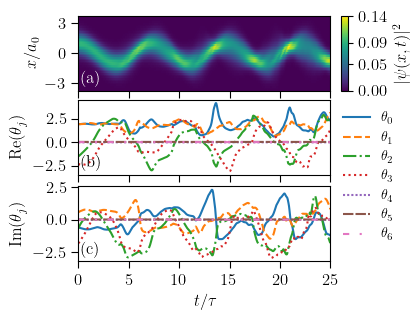

# GASP - Gaussian Activation Single Perceptron

## 1D Quantum Harmonic Oscillator with Stochastic Reconfiguration

### The repository

In this repository we provide a simple PyTorch implementation to solve the 1D quantum harmonic oscillator with stochastic reconfiguration.

We employ a single perceptron with a Gaussian activation fucntion.
This particular case can be analytically solved and thus compared to the numerical results.

An example output is shown below.

