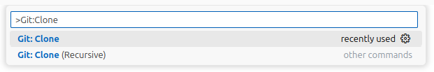
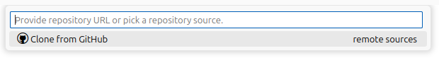
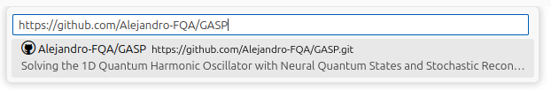
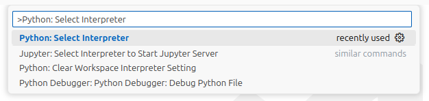
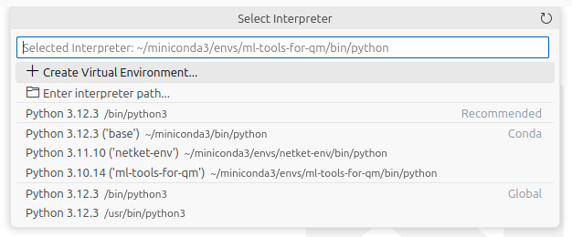

# 1D Quantum Harmonic Oscillator with Stochastic Reconfiguration and Neural Quantum States

In this repository we provide a simple PyTorch implementation to solve the 1D quantum harmonic oscillator (HO) with the stochastic reconfiguration method (SR) and two different types of complex-valued neural networks (NNs) employed as avefunction ansätze, or neural quantum states (NQS).

The first network consists of a single neuron, or perceptron, with a Gaussian activation function (GASP).
The second one, is a common multilayer perceptron or NQS.
In both cases, we use SR to obtain the ground state and perform subsequent dynamics upon a displacement of the trapping potential.

```
├── assets                              
├── LaTeX                               # LaTex files
│   ├── GASP.pdf                            > Report
├── Mathematica                         # SR calculations for GASP
│   ├── GASP_2.nb                           > Two complex parameters
│   └── GASP.nb                             > One complex parameter
├── Python                              # Pytorch code
│   ├── analysis.py                         > data processing methods
│   ├── integrators.py                      > RK4 and Euler integrators
│   ├── main.py                             > main code
│   ├── models.py                           > GASP and NQS classes
│   ├── parameters.py                       > list of parameters
│   ├── plots.py                            > plotting methods
│   ├── stochastic_reconfiguration.py       > SR methods
│   └── utilities.py                        > useful methods
├── .gitignore
├── environment_simple.yml              # environment dependencies simplified
├── environment.yml                     # environment dependencies
├── LICENSE
├── notes.txt 
└── README.md 
```

## Installation (via VSCode)
1. Clone the repository:

> Open Command Palette: `ctrl + P` \
\
\
\
After selectig the repository, a pop-up window will ask where to save it.

2. Create the environment:

> Open terminal: ```ctrl + ` ```  \
`conda env create -f environment.yml`

> You can choose a specific name using `-n` \
`conda env create -n new_environment_name -f environment.yml`

> Use `environment_simple.yml` for minimal installation.

3. Activate environment.

> Using the terminal:\
`conda activate name_of_environment`

> Using Command Pallete:\
\
\
You should see your environment in the list
